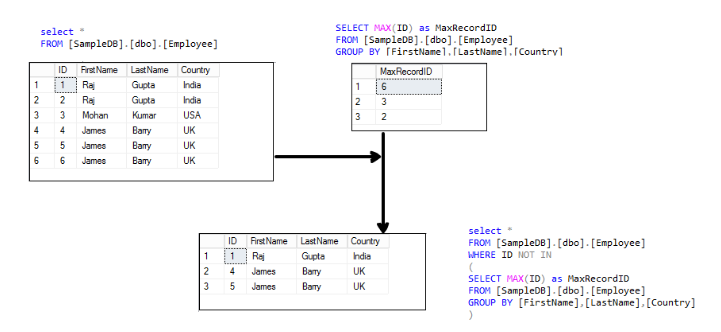
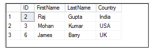

Question:: which CAP theorem oracle, mysql and postgressql follow with example

Answer::
The CAP theorem, formulated by Eric Brewer, states that it is impossible for a distributed computer
system to simultaneously provide all three of the following guarantees:

Consistency (C): All nodes in the system have the same data at the same time, regardless of the node
where the data was accessed or modified.

Availability (A): Every request receives a response, even if some nodes in the system are failing.

Partition tolerance (P): The system continues to operate despite network partitions (communication failures)
between nodes.

Different databases prioritize different aspects of the CAP theorem based on their design and architecture.
Here's how Oracle, MySQL, and PostgreSQL generally align with the CAP theorem:

1. Oracle:

   Oracle traditionally prioritizes consistency and availability over partition tolerance. It aims to
   provide strong consistency and high availability, especially in single data center setups.
   Oracle RAC (Real Application Clusters) provides high availability and scalability within a data center
   but may sacrifice partition tolerance in the event of network partitions.
   Example: Oracle databases typically use synchronous replication and distributed transactions to
   maintain consistency across nodes, ensuring that all nodes have consistent data.

2. MySQL:

   MySQL usually prioritizes availability over strict consistency. It aims to provide high availability
   and partition tolerance, especially in distributed setups.
   MySQL Cluster (NDB) offers high availability and partition tolerance through synchronous replication
   and partitioning of data across multiple nodes.
   Example: In MySQL Cluster, data is sharded and distributed across multiple nodes, allowing the system
   to remain available even if some nodes fail or there are network partitions.

3. PostgreSQL:

   PostgreSQL generally aims to balance consistency and availability while maintaining partition
   tolerance. It supports various replication and clustering options to achieve high availability and
   fault tolerance.
   PostgreSQL's synchronous replication and streaming replication options offer strong consistency
   guarantees while also ensuring availability.
   Example: PostgreSQL's synchronous replication mode ensures that transactions are committed
   synchronously to multiple nodes before acknowledging the transaction's completion, providing consistency across nodes.

Question::
DDL & DML
Answer::

In SQL, DDL (Data Definition Language) and DML (Data Manipulation Language) are two categories of SQL
commands used to perform different types of operations on a database. Here's an overview of each:

DDL (Data Definition Language):

DDL commands are used to define, modify, and manage the structure of database objects such as tables, indexes, views, and schemas.
Common DDL commands include CREATE, ALTER, DROP, and TRUNCATE.
DDL commands do not manipulate data within the database, but rather define its structure.
Examples of DDL Commands:

CREATE TABLE: Creates a new table in the database.
CREATE TABLE employees (
    emp_id INT PRIMARY KEY,
    emp_name VARCHAR(50),
    emp_salary DECIMAL(10, 2)
);

ALTER TABLE: Modifies the structure of an existing table.

ALTER TABLE employees
ADD emp_department VARCHAR(50);

DROP TABLE: Deletes an existing table from the database.

DROP TABLE employees;

CREATE INDEX: Creates an index on one or more columns of a table to improve query performance.

CREATE INDEX idx_emp_name ON employees(emp_name);

DML (Data Manipulation Language):

DML commands are used to manipulate data stored in the database tables.
Common DML commands include SELECT, INSERT, UPDATE, DELETE, and MERGE.
DML commands are used to retrieve, insert, modify, or delete data within the database tables.
Examples of DML Commands:

SELECT: Retrieves data from one or more tables.

SELECT emp_name, emp_salary FROM employees WHERE emp_department = 'Sales';

INSERT: Adds new rows of data into a table.
INSERT INTO employees (emp_name, emp_salary, emp_department)
VALUES ('John Doe', 50000, 'HR');

UPDATE: Modifies existing data within a table.

UPDATE employees SET emp_salary = 55000 WHERE emp_id = 101;

DELETE: Removes one or more rows from a table.

DELETE FROM employees WHERE emp_id = 101;

MERGE: Performs insert, update, or delete operations on a target table based on the results of a
join with a source table.

MERGE INTO target_table AS Target
USING source_table AS Source
ON Target.id = Source.id
WHEN MATCHED THEN
    UPDATE SET Target.value = Source.value
WHEN NOT MATCHED THEN
    INSERT (id, value) VALUES (Source.id, Source.value);

============================================================================================================

Question: delete duplicate records in sql
Answer: We use the SQL MAX function to calculate the max id of each data row.

        SELECT *
            FROM [SampleDB].[dbo].[Employee]
            WHERE ID NOT IN
            (
                SELECT MAX(ID)
                FROM [SampleDB].[dbo].[Employee]
                GROUP BY [FirstName],
                         [LastName],
                         [Country]
            );

In the following screenshot, we can see that the above Select statement excludes the Max id of
each duplicate row and we get only the minimum ID value.

To remove this data, replace the first Select with the SQL delete statement as per the following query.

DELETE FROM [SampleDB].[dbo].[Employee]
    WHERE ID NOT IN
    (
        SELECT MAX(ID) AS MaxRecordID
        FROM [SampleDB].[dbo].[Employee]
        GROUP BY [FirstName],
                 [LastName],
                 [Country]
    );
Once you execute the delete statement, perform a select on an Employee table,
and we get the following records that do not contain duplicate rows.

============================================================================================================
Question:: What is a correlated subquery? Provide an example.

Example:
==>
SELECT *
FROM employees e
WHERE salary > (
    SELECT AVG(salary)
    FROM employees
    WHERE department_id = e.department_id
);

Question:: Explain the difference between INNER JOIN, LEFT JOIN, and RIGHT JOIN with examples.

Example:
==>
-- INNER JOIN: Returns rows when there is a match in both tables
SELECT *
FROM employees e
INNER JOIN departments d ON e.department_id = d.department_id;

-- LEFT JOIN: Returns all rows from the left table and matching rows from the right table
SELECT *
FROM employees e
LEFT JOIN departments d ON e.department_id = d.department_id;

-- RIGHT JOIN: Returns all rows from the right table and matching rows from the left table
SELECT *
FROM employees e
RIGHT JOIN departments d ON e.department_id = d.department_id;

Question:: Explain the concept of a window function. Provide an example.

Example:
==>
SELECT department_id, emp_id, emp_salary,
       ROW_NUMBER() OVER(PARTITION BY department_id ORDER BY emp_salary DESC) AS rank
FROM employees;

Question:: What are common aggregate functions in SQL? Provide examples.

Example:
==>
SELECT AVG(salary), SUM(sales), MAX(age), MIN(height)
FROM employees;

Question:: How do you handle NULL values in SQL queries? Provide examples.

Example:
==>
SELECT emp_id, emp_name
FROM employees
WHERE emp_age IS NOT NULL;

Question:: Explain the purpose of the HAVING clause. Provide an example.

Example:
==>
SELECT department_id, AVG(salary)
FROM employees
GROUP BY department_id
HAVING AVG(salary) > 5000;

Question:: What is a recursive SQL query? Provide an example.

Example:
==>
WITH RECURSIVE cte AS (
    SELECT emp_id, manager_id, 1 AS level
    FROM employees
    WHERE manager_id IS NULL
    UNION ALL
    SELECT e.emp_id, e.manager_id, cte.level + 1
    FROM employees e
    INNER JOIN cte ON e.manager_id = cte.emp_id
)
SELECT *
FROM cte;

Question:: How do you pivot data in SQL? Provide an example.

Example:
==>
SELECT *
FROM (
    SELECT emp_id, department_id, salary
    FROM employees
) AS SourceTable
PIVOT (
    AVG(salary) FOR department_id IN ([1], [2], [3])
) AS PivotTable;

Question:: What are Common Table Expressions (CTEs)? Provide an example.

Example:
==>
WITH cte AS (
    SELECT emp_id, emp_name
    FROM employees
    WHERE emp_age > 30
)
SELECT *
FROM cte;

Question:: Explain the difference between UNION and UNION ALL. Provide examples.

Example:
==>
-- UNION: Returns unique rows from both queries
SELECT emp_id, emp_name
FROM employees
UNION
SELECT emp_id, emp_name
FROM former_employees;

-- UNION ALL: Returns all rows from both queries, including duplicates
SELECT emp_id, emp_name
FROM employees
UNION ALL
SELECT emp_id, emp_name
FROM former_employees;

Question:: What is a cross join in SQL? Provide an example.

Example:
==>
SELECT *
FROM employees
CROSS JOIN departments;

Question:: Explain the purpose of the CASE statement in SQL. Provide an example.

Example:
==>
SELECT emp_name,
       CASE
           WHEN emp_salary > 5000 THEN 'High'
           WHEN emp_salary > 3000 THEN 'Medium'
           ELSE 'Low'
       END AS salary_category
FROM employees;

Question:: How do you rank rows in SQL? Provide an example using the RANK() function.

Example:
==>
SELECT emp_name, emp_salary,
       RANK() OVER(ORDER BY emp_salary DESC) AS salary_rank
FROM employees;

Question:: What is the purpose of the MERGE statement in SQL? Provide an example.

Example:
==>
MERGE INTO target_table AS Target
USING source_table AS Source
ON Target.id = Source.id
WHEN MATCHED THEN
    UPDATE SET Target.value = Source.value
WHEN NOT MATCHED THEN
    INSERT (id, value) VALUES (Source.id, Source.value);

Question:: Explain the difference between a clustered and non-clustered index. Provide examples.

Example:
==>
-- Clustered Index
CREATE CLUSTERED INDEX idx_emp_id ON employees(emp_id);

-- Non-Clustered Index
CREATE INDEX idx_department_id ON employees(department_id);

Question:: How do you handle transactions in SQL? Provide an example.

Example:
==>
BEGIN TRANSACTION;
-- SQL statements
COMMIT;

Question:: What is a self-join in SQL? Provide an example.

Example:
==>
SELECT e1.emp_name AS employee_name, e2.emp_name AS manager_name
FROM employees e1
JOIN employees e2 ON e1.manager_id = e2.emp_id;

Question:: Explain the purpose of the ROW_NUMBER() function in SQL. Provide an example.

Example:
==>
SELECT emp_name, emp_salary,
       ROW_NUMBER() OVER(ORDER BY emp_salary DESC) AS rank
FROM employees;

Question:: How do you optimize SQL queries for performance? Provide examples of optimization techniques.

Example:
==>
-- Example of query optimization with proper indexing
CREATE INDEX idx_department_id ON employees(department_id);

-- Example of query optimization with proper join order
SELECT *
FROM large_table1 t1
JOIN small_table2 t2 ON t1.id = t2.id;

Question:: What are subqueries in SQL? Provide examples of different types of subqueries.

Example:
==>
-- Scalar Subquery
SELECT emp_name, (SELECT MAX(salary) FROM salaries) AS max_salary
FROM employees;

-- Correlated Subquery
SELECT emp_name
FROM employees e
WHERE emp_salary > (SELECT AVG(emp_salary) FROM employees WHERE department_id = e.department_id);

Question:: What is a recursive CTE (Common Table Expression) in SQL? Provide an example.
Answer:

Recursive CTEs allow for iterative processing in SQL, enabling operations like hierarchical data traversal.
Example:

==>
WITH RECURSIVE CTE AS (
    SELECT emp_id, emp_name, manager_id
    FROM employees
    WHERE manager_id IS NULL
    UNION ALL
    SELECT e.emp_id, e.emp_name, e.manager_id
    FROM employees e
    JOIN CTE ON e.manager_id = CTE.emp_id
)
SELECT * FROM CTE;

Question:: Explain the difference between a subquery and a join. When would you use each?
Answer:

Subquery: A subquery is a query nested within another query. It's used to retrieve data that will be used by the main query.
Join: A join is used to combine rows from two or more tables based on related columns.
Example:

==>
-- Subquery
SELECT emp_name
FROM employees
WHERE department_id = (SELECT department_id FROM departments WHERE department_name = 'Sales');

-- Join
SELECT e.emp_name
FROM employees e
JOIN departments d ON e.department_id = d.department_id
WHERE d.department_name = 'Sales';

Question:: What is the purpose of the GROUP BY WITH ROLLUP clause in SQL? Provide an example.
Answer:

GROUP BY WITH ROLLUP is used to generate subtotals and totals for groups of rows in a result set.
Example:

==>
SELECT department_id, COUNT(*) AS emp_count
FROM employees
GROUP BY department_id WITH ROLLUP;

Question:: Explain the concept of database normalization. Why is it important?
Answer:

Database normalization is the process of organizing the attributes and tables of a relational database to minimize redundancy and dependency.
It reduces data redundancy, improves data integrity, and facilitates data maintenance and querying.

Question:: Difference between Function and Stored Procedure with example?

Answer:

1. Return Type:

   Functions must return a value, whereas stored procedures may or may not return a value.
   Example of a Function:

   CREATE FUNCTION GetEmployeeCount()
   RETURNS INT
   AS
   BEGIN
       DECLARE @count INT;
       SELECT @count = COUNT(*) FROM employees;
       RETURN @count;
   END;

   Example of a Stored Procedure:
   CREATE PROCEDURE GetEmployeeList
   AS
   BEGIN
       SELECT * FROM employees;
   END;

2. Usage in Queries:

   Functions can be used in SELECT statements and expressions, whereas stored procedures cannot be used directly in queries.
   Example of Using a Function in a Query:

   SELECT emp_name, GetEmployeeAge(emp_id) AS age
   FROM employees;

3. Transaction Management:

   Stored procedures can contain transaction management statements (BEGIN TRANSACTION, COMMIT, ROLLBACK), while functions cannot.
   Example of Transaction Management in a Stored Procedure:

   CREATE PROCEDURE InsertEmployee
       @emp_name VARCHAR(50),
       @emp_salary DECIMAL(10, 2)
   AS
   BEGIN
       BEGIN TRANSACTION;
       INSERT INTO employees (emp_name, emp_salary) VALUES (@emp_name, @emp_salary);
       COMMIT;
   END;
4. Scope of Variables:

   Functions can only access variables declared within the function, whereas stored procedures can access variables declared outside the procedure.
   Example of Variable Scope in a Function:

    CREATE FUNCTION GetEmployeeName(@emp_id INT)
    RETURNS VARCHAR(50)
    AS
    BEGIN
        DECLARE @emp_name VARCHAR(50);
        SELECT @emp_name = emp_name FROM employees WHERE emp_id = @emp_id;
        RETURN @emp_name;
    END;

5. Parameter Passing:

   Functions can be called as part of an expression and can return a single value, whereas stored procedures can accept input parameters and return multiple result sets.
   Example of Using Parameters in a Stored Procedure:
   CREATE PROCEDURE GetEmployeesByDepartment
       @dept_id INT
   AS
   BEGIN
       SELECT * FROM employees WHERE department_id = @dept_id;
   END;

6. Use in DML Statements:

   Functions cannot contain DML (Data Manipulation Language) statements like INSERT, UPDATE, DELETE, whereas stored procedures can.
   Example of Using DML in a Stored Procedure:

   CREATE PROCEDURE UpdateEmployeeSalary
       @emp_id INT,
       @new_salary DECIMAL(10, 2)
   AS
   BEGIN
       UPDATE employees SET emp_salary = @new_salary WHERE emp_id = @emp_id;
   END;

Question:: What is a stored procedure in SQL? Provide an example.

Answer::
A stored procedure is a precompiled collection of SQL statements that can be stored and executed on demand.
Example:

==>
CREATE PROCEDURE GetEmployeesByDepartment(IN dept_id INT)
BEGIN
    SELECT * FROM employees WHERE department_id = dept_id;
END;

Question:: Difference between Function and Stored Procedure with example?

==>

Question:: How do you optimize SQL queries for performance? Provide examples of optimization techniques.
Answer:

Optimization techniques include indexing, proper join order, avoiding unnecessary operations, and rewriting
complex queries.
Example:

==>
-- Indexing
CREATE INDEX idx_department_id ON employees(department_id);

-- Join order
SELECT *
FROM large_table1 t1
JOIN small_table2 t2 ON t1.id = t2.id;

Question:: What is a transaction in SQL? How do you ensure data integrity using transactions?
Answer:

A transaction is a unit of work performed within a database management system. It's a sequence of operations that are treated as a single logical unit.
Transactions ensure data integrity by allowing changes to be either committed (made permanent) or rolled back (undone) in case of failure.

Question:: Explain the purpose of the EXISTS and NOT EXISTS operators in SQL. Provide examples.
Answer:

EXISTS and NOT EXISTS are used to test for the existence of rows in a subquery result.
Example:

==>
-- EXISTS
SELECT emp_name
FROM employees e
WHERE EXISTS (SELECT * FROM salaries s WHERE s.emp_id = e.emp_id);

-- NOT EXISTS
SELECT emp_name
FROM employees e
WHERE NOT EXISTS (SELECT * FROM former_employees f WHERE f.emp_id = e.emp_id);

Question:: What are database transactions? Explain ACID properties.
Answer:

Database transactions are sequences of operations performed as a single logical unit of work.
ACID properties ensure that database transactions are processed reliably:
Atomicity: All operations in a transaction are completed successfully or none are.
Consistency: A transaction transforms the database from one consistent state to another.
Isolation: Transactions are isolated from each other, ensuring concurrent execution does not interfere.
Durability: Changes made by committed transactions are permanent and survive system failures.

Question:: How do you handle duplicate rows in a SQL result set? Provide examples.

Answer:

Duplicate rows can be removed using DISTINCT, or duplicates can be aggregated using GROUP BY.
Example:

==>
-- Removing duplicates
SELECT DISTINCT emp_name FROM employees;

-- Aggregating duplicates
SELECT emp_id, COUNT(*) AS num_employees FROM employees GROUP BY emp_id;

Question::

1. Use Proper Indexing:

Create indexes on columns used in filtering conditions, joins, and order by clauses to speed up data retrieval.
==>
CREATE INDEX idx_department_id ON employees(department_id);
CREATE INDEX idx_manager_id ON employees(manager_id);
Avoid SELECT * and Fetch Only Necessary Columns:

2. Retrieve only the columns required for analysis to minimize data transfer and reduce query execution time.
==>
SELECT emp_name, emp_salary
FROM employees
WHERE department_id = 1;
Optimize JOIN Operations:

3. Use appropriate join types (e.g., INNER JOIN, LEFT JOIN) and ensure indexed columns are used for join conditions.
==>
SELECT e.emp_name, d.department_name
FROM employees e
JOIN departments d ON e.department_id = d.department_id;
Use WHERE Conditions to Filter Data Early:

4. Apply filtering conditions directly in the WHERE clause to reduce the dataset size before additional processing.
==>
SELECT *
FROM employees
WHERE department_id = 1 AND emp_salary > 50000;

5. Optimize Subqueries and Correlated Queries:

Rewrite subqueries or correlated queries to minimize their impact on overall query performance.
==>
SELECT emp_name
FROM employees
WHERE department_id = (
    SELECT department_id
    FROM departments
    WHERE department_name = 'Sales'
);

6. Use Analytical Functions for Aggregation:
Utilize window functions or analytical functions for aggregating and analyzing employee data efficiently.
==>
SELECT department_id, AVG(emp_salary) OVER (PARTITION BY department_id) AS avg_salary
FROM employees;

7.Partitioning Large Tables:

Partition the employee table based on relevant criteria (e.g., department) to distribute data across multiple physical files and improve query performance.
==>
CREATE TABLE employees (
    ...
) PARTITION BY RANGE (department_id) (
    PARTITION p1 VALUES LESS THAN (100),
    PARTITION p2 VALUES LESS THAN (200),
    ...
);

8.Consider Caching Query Results: [alternatively you can use, application-side redis in-memory cache]

If employee data does not change frequently, consider caching query results to reduce the load on the database server.
==>
SELECT /*CACHE*/ emp_name, emp_salary
FROM employees
WHERE department_id = 1;

9.Optimize Memory and Disk Usage:

Ensure sufficient memory and disk resources are allocated to handle the query workload efficiently.
Consider optimizing database configuration settings for memory usage, disk I/O, and parallelism.

================================================================================================================

Calling stored procedures and functions from a Spring Boot application involves using JDBC (Java Database Connectivity) templates or JPA (Java Persistence API) repositories. Below, I'll provide examples of how to call both stored procedures and functions using these approaches.

Calling Stored Procedure using JDBC Template
import org.springframework.beans.factory.annotation.Autowired;
import org.springframework.jdbc.core.JdbcTemplate;
import org.springframework.stereotype.Service;

@Service
public class EmployeeService {

    @Autowired
    private JdbcTemplate jdbcTemplate;

    public void callStoredProcedure() {
        String procedureCall = "CALL my_stored_procedure(?, ?)"; // Replace with your stored procedure name and parameters

        jdbcTemplate.update(procedureCall, "param1", "param2"); // Replace "param1" and "param2" with actual parameter values
    }
}

Calling Function using JDBC Template
import org.springframework.beans.factory.annotation.Autowired;
import org.springframework.jdbc.core.JdbcTemplate;
import org.springframework.stereotype.Service;

@Service
public class EmployeeService {

    @Autowired
    private JdbcTemplate jdbcTemplate;

    public String callFunction() {
        String functionCall = "SELECT my_function(?, ?)"; // Replace with your function name and parameters

        return jdbcTemplate.queryForObject(functionCall, String.class, "param1", "param2"); // Replace "param1" and "param2" with actual parameter values
    }
}

Calling Stored Procedure using JPA Repository
import org.springframework.beans.factory.annotation.Autowired;
import org.springframework.stereotype.Service;

import javax.persistence.EntityManager;
import javax.persistence.ParameterMode;
import javax.persistence.StoredProcedureQuery;

@Service
public class EmployeeService {

    @Autowired
    private EntityManager entityManager;

    public void callStoredProcedure() {
        StoredProcedureQuery procedureQuery = entityManager.createStoredProcedureQuery("my_stored_procedure");

        procedureQuery.registerStoredProcedureParameter("param1", String.class, ParameterMode.IN);
        procedureQuery.registerStoredProcedureParameter("param2", String.class, ParameterMode.IN);

        procedureQuery.setParameter("param1", "param1 value");
        procedureQuery.setParameter("param2", "param2 value");

        procedureQuery.execute();
    }
}

Calling Function using JPA Repository
import org.springframework.beans.factory.annotation.Autowired;
import org.springframework.stereotype.Service;

import javax.persistence.EntityManager;
import javax.persistence.Query;

@Service
public class EmployeeService {

    @Autowired
    private EntityManager entityManager;

    public String callFunction() {
        Query query = entityManager.createNativeQuery("SELECT my_function(:param1, :param2)");
        query.setParameter("param1", "param1 value");
        query.setParameter("param2", "param2 value");

        return (String) query.getSingleResult();
    }
}
